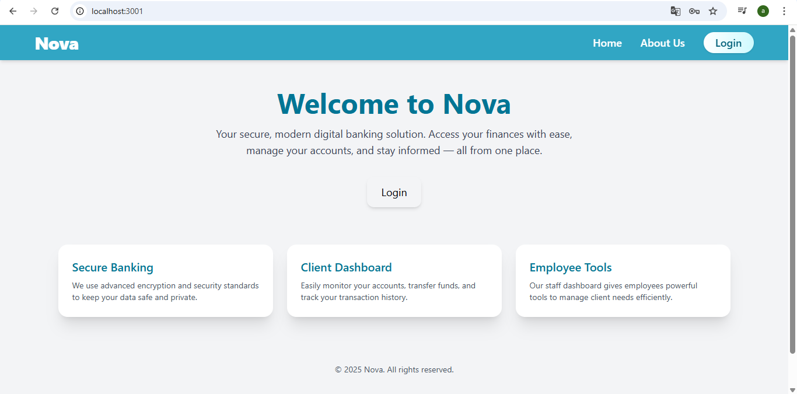
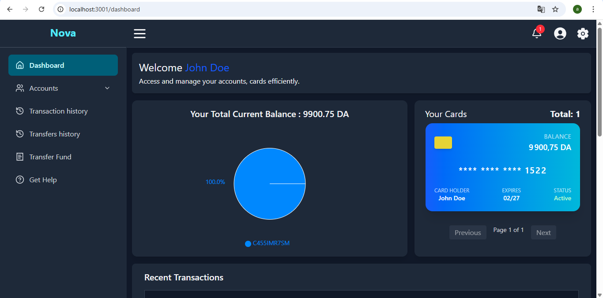
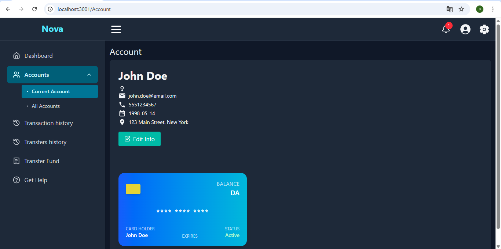
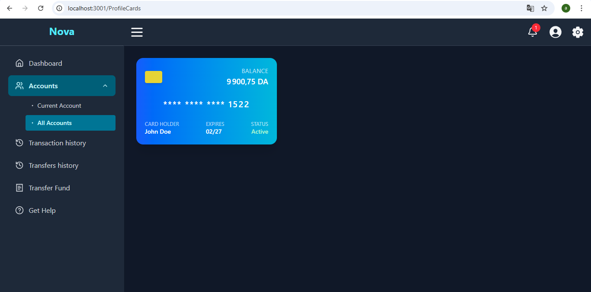
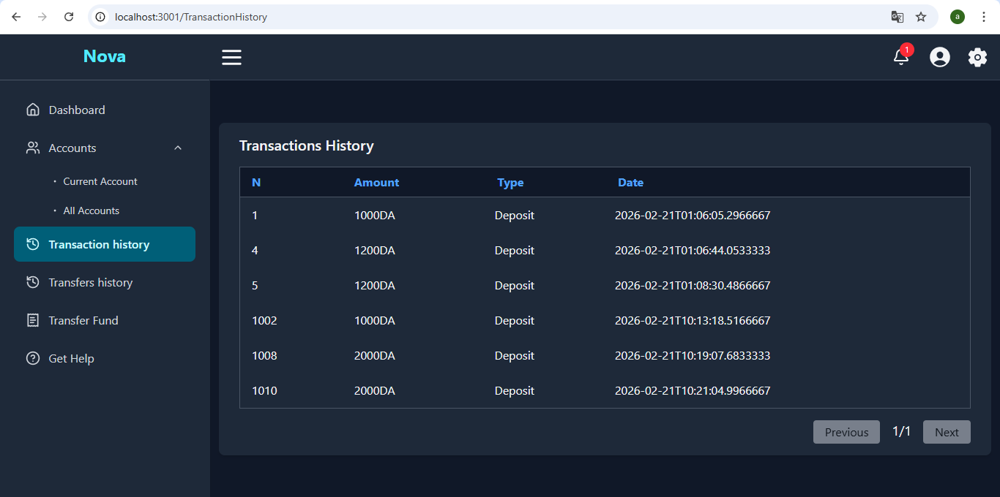
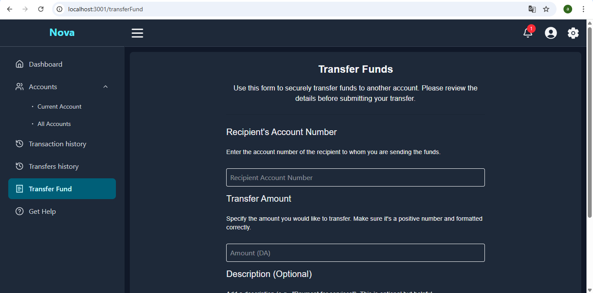
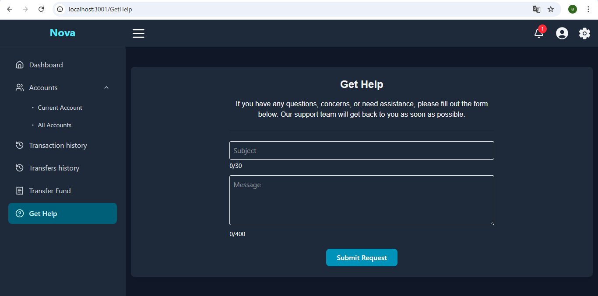

# 📚 Nova

**Nova** is a full-stack web banking application Built with React, Tailwind CSS, and ASP.NET Core Web API.

---

## Tech Stack

- **Frontend:** React + TypeScript + Tailwind CSS
- **Backend:** ASP.NET Core 8 + EF Core + JWT Authentication
- **Database:** SQL Server
- **Containerization:** Docker

---

## Getting Started

### 1. Clone the repository

```bash
git clone https://github.com/Abdellah-saim-mamoune1/Nova
cd Nova
```

### 2. Run and build docker-compose files

First, make sure you docker is running in your local computer.
Then run this command in the terminal while being inside the project folder Nova:

```bash
docker-compose up -d --build
```

### 3. Try the project

After the containers are running, you can go to the frontend page via: http://localhost:3001/.
You can olso test the backend endpoints using swagger via: http://localhost:8101/swagger/index.html.

Now i have prepared a sample data in .Backend/db_samples, so if you want to login to the system and try it as an employee in swagger (you cannot login via the frontend page since i made only the client pages), Yo must use the employees data in the Sample Class, and the employee login account must be written in this format: firstname.lastname@Nova.com, the password enter it as it is.

For client login, you can either use swagger or the frontend login page. The process is similar to the employee login, but with some differences such as:
The client login account is not the same as the personal email neither like the employee account, and you will not find it in the Sample class since it is generated randomly after creating the new client or their new account. So to access clients accounts, you must first log in as employee via swagger or postman, then go to the ClientAdmin controller and call the /api/employee/client/clients/{PageNumber},{PageSize} endpoint with page number=1 and page size>=2. The endpoint will respond by sending the clients data. you must copy one of the clients Id, then use as a parameter in the /api/employee/client/accounts/{Id} endpoint. The endpoint will respond with the client accounts data. Copy one of the accounts, then use it as the login account. for the password you can find it in the Sample class.

Finally after login to the system as an amployee or as a client, you will be able to call the endpoints that matches your user authorization roles.


## Screenshots








## Features
 User login & JWT authentication

 Managing clients, employees, money transfers, Deposits/Withdrawls

 Role-based access (admin, client)

 Responsive UI with Tailwind

---


 ## Contributions
 Contributions are welcomed.
 
---

 ## Contact
 If you have any questions or suggestions, reach out at: abdellahsaimmamoune1@gmail.com.
 


